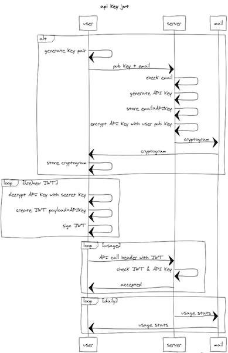

# Authenticated API

`Authenticated API` is a simple implementation convention, based on the out of band challenge mechanism.

The main purpose of this convention is to support authentication, what is similar to classical *public private key* based authentication, for software agents (*scripts*) doing API calls in *single request response* pattern.
Key pairs are two cryptographically secure keys that can be used to sign message from client to server, so server can verify client (*authenticate*). Each key pair consists of a public key and a private key. The private key is retained by the client and should be kept absolutely secret.

While this reference implementation is for NodeJS and utilizes OpenID Connect ID token, the convention does not restrict the type of JSON Web Tokens (JWT) that could be used to transport the authentication claim, as long as the token contains the nonce field. Same applies to PKI X509 client certificate based authentication.

## The convention

- The message from the client to the server MUST contain the `HTTP Authorization request header`.
- The HTTP Authorization request header type MUST be `Bearer`.
- The HTTP Authorization request header credentials MUST be a `JWT` with a *nonce* (API KEY) field and *email address* in the decoded payload, which values matches the nonce (API KEY) of the previous out of band message from the server handler to the clients email.
- The JWT MUST be signed with clients private key, which matches the public key of the previous out of band message from the client (to the server (handler)).
- The server application MUST check that
  - the `nonce` field of the JWT payload MUST match the nonce (API KEY) sent to the client email.
  - the `aud` field of the JWT payload MUST match the origin of the http connection and that the origin is in the scope of accepted origins for the application
  - the `iat` and `exp` fields of the JWT payload MUST be within the accepted time window for the application
  - the signature of the JWT payload MUST be verified and that the used algorithm MUST be approved for the application (*RS256*)
  - the JWT SHOULD NOT contain the x5u nor x5c. Certificates or references MUST be available out of band.

  After the request check described above, the request is considered as authenticated.

  - Authenticated API's facing public Internet or servers running in the cloud, MUST use a secure http connection (`https://`)

----

