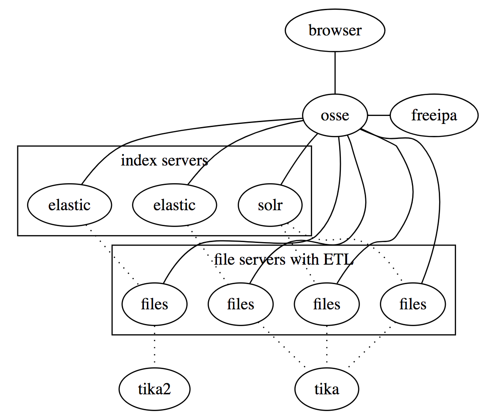
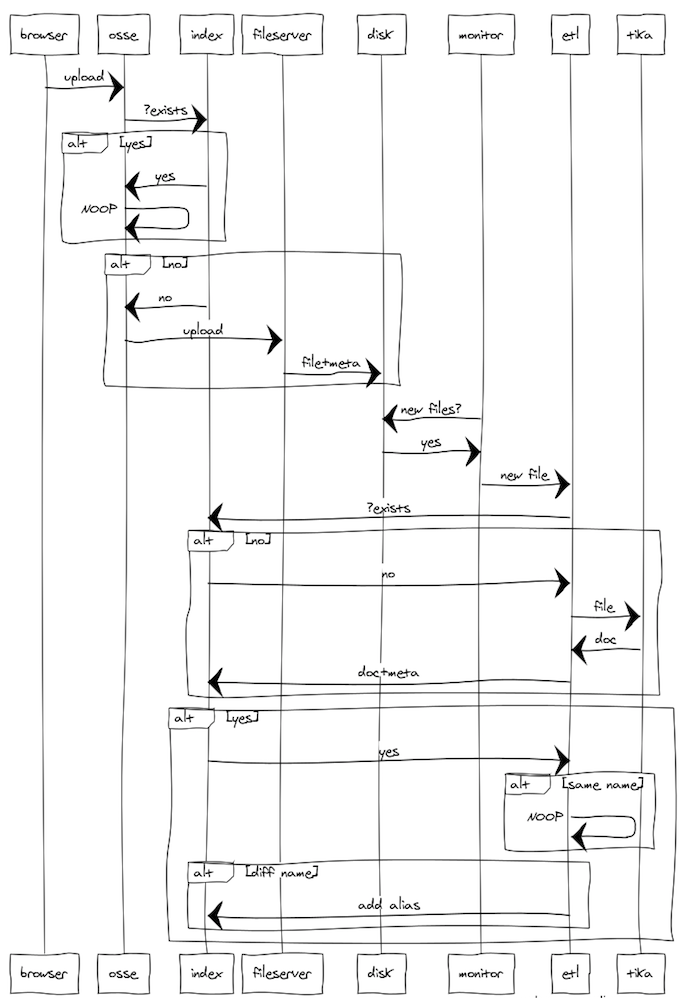

# OSSE

search in both SOLR(s) and ElasticSearch(s)

----

graph osse {

  {rank=same osse freeipa}
  browser -- osse -- freeipa
  subgraph cluster_i {
  label = "index servers"
  i1 [label="solr"]
  i2 [label="elastic"]
  i3 [label="elastic"]
  }
  subgraph cluster_f {
  label = "file servers with ETL"
  f1 [label="files"]
  f2 [label="files"]
  f3 [label="files"]
  f4 [label="files"]
  }

  osse -- {i1 i2 i3}
  osse -- {f1 f2 f3 f4}
  {f1 f2 f3 } -- tika [style="dotted"]
 {f4} -- tika2 [style="dotted"]
  {i1} --  {f1 f2 } [style="dotted"]
  {i3} --  {f3 } [style="dotted"]
  {i2} --  {f4 } [style="dotted"]

}

--------

title Upload

browser->osse: upload
osse->index:?exists
alt yes
index->osse: yes
osse->osse:NOOP
end
alt no
index->osse: no
osse->fileserver:upload
fileserver->disk:file+meta
end
monitor->disk:new files?
disk->monitor:yes
monitor->etl:new file
etl->index:?exists
alt no
index->etl:no
etl->tika:file
tika->etl:doc
etl->index:doc+meta
end
alt yes
index->etl:yes
alt same name
etl->etl:NOOP
end
alt diff name
etl->index:add alias
end
end
